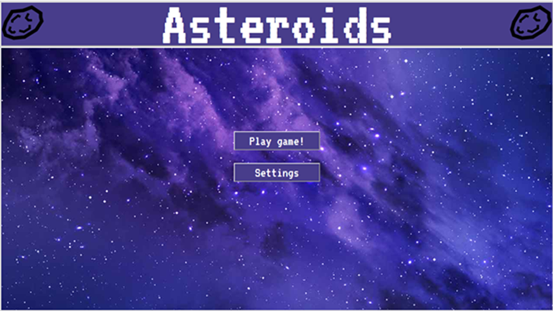
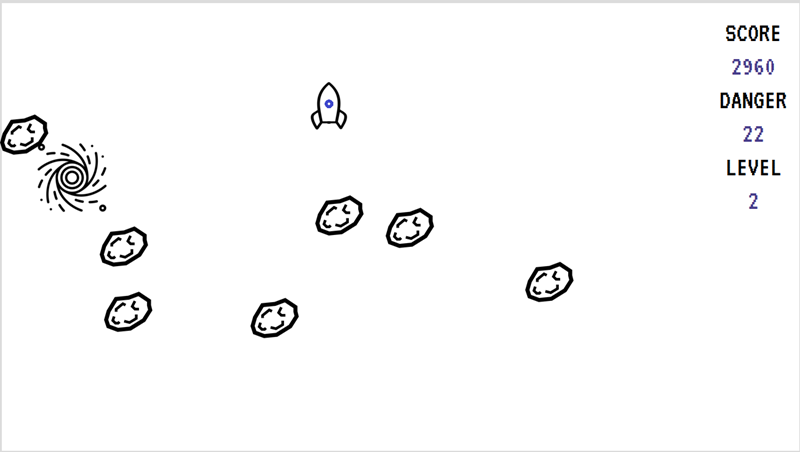
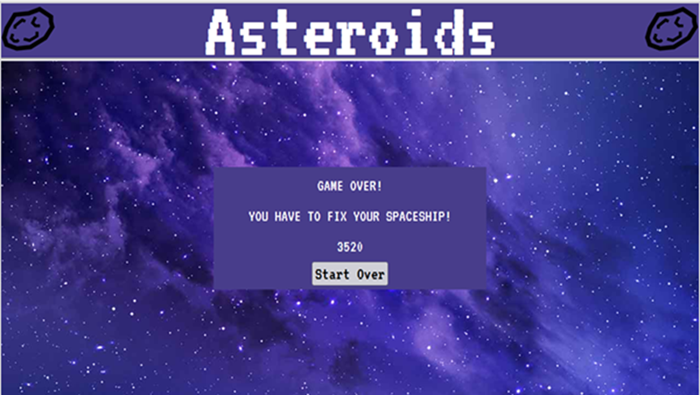
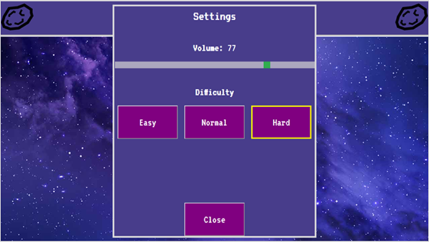

# Asteroids Game

## Disclaimer
This repo is just a display of a course project for EECS 493 User Interface Development @ University of Michigan. I'm excluding the code to comply with academic integrity policies.

## Technologies Used
- **Frontend**: HTML, CSS, JavaScript, jQuery

## Project Overview
Classic *Asteroids* game with interactive UI components. The player controls a rocket with the goal of avoiding asteroids, collecting shields, and passing through portals to increase levels. Features include:
- **Dynamic Asteroid Spawning**: Asteroids spawn randomly and move across the screen at increasing speeds.
- **Power-Ups**: Shields and portals spawn at regular intervals, enabling players to gain protection or advance levels.
- **Rocket Movement**: Player can move the rocket using arrow keys with animations based on direction.
- **Scoreboard**: Tracks score, level, and danger metrics dynamically during gameplay.
- **Game States**: Includes a "Get Ready" splash screen and a "Game Over" page.
- **Audio Effects**: Sound effects play for collisions, level-ups, and item pickups.
- **Settings Integration**: Adjustable difficulty levels and sound volume.

## Game Features and Mechanics
### Asteroid Spawning
- Asteroids appear randomly on the screen.
- Speeds and spawn rates vary with difficulty:
  - **Easy**: Slower spawn rate and speed.
  - **Medium**: Faster spawn rate and speed.
  - **Hard**: Fastest spawn rate and speed.
- Asteroids disappear after crossing the game board.

### Power-Ups (Shields and Portals)
- **Portals**: Spawn every 15 seconds; disappear after 5 seconds.
- **Shields**: Spawn every 10 seconds; disappear after 5 seconds.
- Power-ups spawn at random locations within the game board.

### Rocket Movement
- Player moves the rocket using arrow keys.
- Animated directional gifs indicate movement direction.
- Rocket collisions with:
  - **Asteroid (No Shield)**: Ends the game and transitions to "Game Over" screen.
  - **Asteroid (With Shield)**: Removes the shield but gameplay continues.
  - **Shield**: Grants a shield.
  - **Portal**: Increases level and speed of asteroids.

### Scoreboard
- Tracks the following:
  - **Score**: Increases every 500 milliseconds the player survives.
  - **Danger**: Increases by 2 every time a level increases.
  - **Level**: Tracks the player’s progress through the portals.

### Game Screens
- **Landing Page**: Starting point for the game.
- **“Get Ready” Splash Screen**: Displays before gameplay starts.
- **Game Over Screen**: Displays player score and provides a restart option.

### Audio Effects
- Collecting items or dying triggers specific sound effects.
- Volume is adjustable through the settings menu.

## Code Tree
<pre>
├── index.html
├── scripts
│   ├── jquery.min.js
│   └── page.js
├── src
│   ├── arrowkeys.png
│   ├── asteroid.png
│   ├── audio
│   │   ├── collect.mp3
│   │   ├── die.mp3
│   │   └── pew.mp3
│   ├── frontpage_background.jpg
│   ├── player
│   │   ├── player.gif
│   │   ├── player_down.gif
│   │   ├── player_left.gif
│   │   ├── player_right.gif
│   │   ├── player_shielded.gif
│   │   ├── player_shielded_down.gif
│   │   ├── player_shielded_left.gif
│   │   ├── player_shielded_right.gif
│   │   ├── player_shielded_up.gif
│   │   ├── player_touched.gif
│   │   └── player_up.gif
│   ├── port.gif
│   └── shield.gif
└── style
    └── index.css
</pre>
